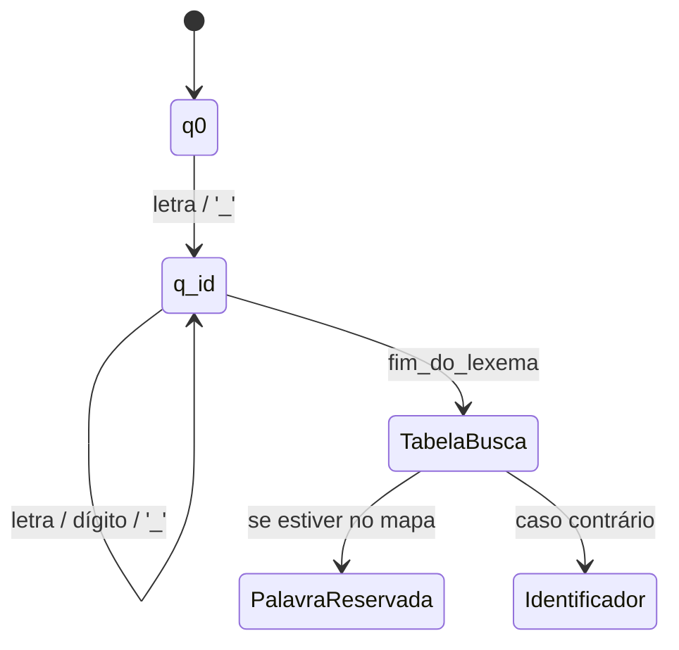
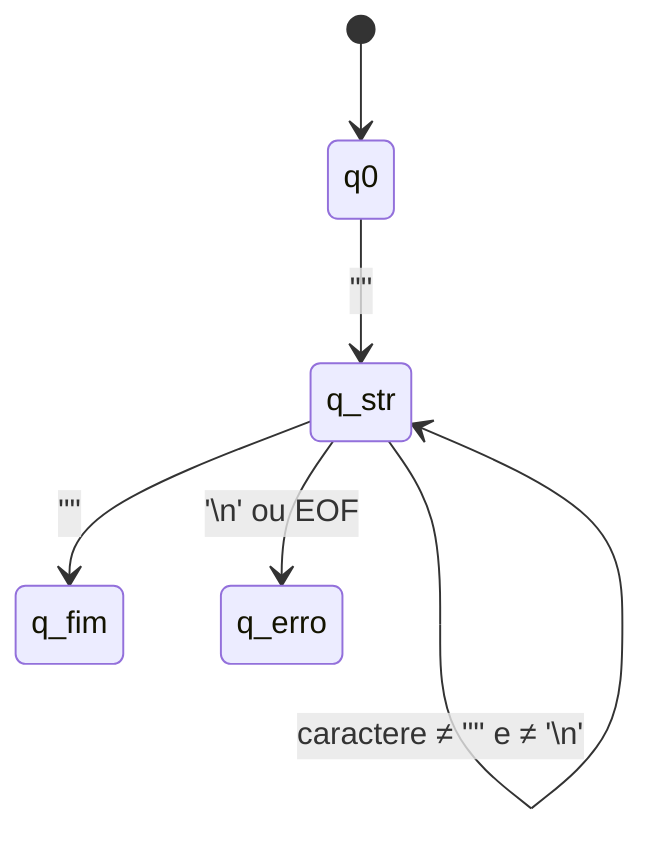

### automato finito determinístico - identificador e palavra reservada
necessário plugin mermaid do intellij

### Autômato Finito Determinístico - String

#### AFD de Identificador: 
    Estado q0 -> estado inicial no switch (c) em scanToken().
    Estado q_id -> laço while no método identificador().
    TabelaBusca -> consulta ao palavrasReservadas.get(texto).
#### AFD de String:
    Estado q0 -> case '"' no switch (c).
    Estado q_str -> laço while no método string().
    Estado q_erro -> chamada do método erroEm(...) ao detetar \n ou EOF.